# Letícia Torquato

### Analista de Qualidade (QA) & Processos

 

  

 

---

## 💻 Sobre Mim

> **Engenharia de Qualidade de Software unida à Governança de Processos.**

Sou **Analista de QA** com **mais de 14 anos de atuação dedicada à área de testes e garantia de qualidade**. **Atualmente atuo na NEXDOM Healthtech**, onde sou responsável pela garantia de qualidade e validações funcionais de sistemas de saúde digital, construindo uma trajetória sólida no desenvolvimento de ecossistemas de alta qualidade para **Healthtechs e Saúde Suplementar** (com passagens também por *Unimed Curitiba* e *Benner*). Ao longo desses anos, evoluí de uma visão puramente técnica de testes para uma atuação estratégica, sendo hoje a ponte entre os times de Tecnologia, Negócio e Regulação — garantindo que o software não apenas funcione sem falhas, mas que siga processos escaláveis, auditáveis e alinhados às normas vigentes.

Combino **domínio técnico em testes manuais e automatizados** com **certificação Green Belt em Lean Seis Sigma**, unindo qualidade de produto e qualidade de processo em uma única frente de atuação — um diferencial construído ao longo de mais de uma década de experiência prática no setor.

 

<table>
<tr>
<td width="50%" valign="top">

### 🔍 Foco & Qualidade de Software
* **Análise de Requisitos & Regras de Negócio:** Mapeamento profundo e testes em cenários operacionais complexos.
* **Testes & Modelagem:** Estruturação de cenários com BDD (Gherkin), testes funcionais, usabilidade, regressão e testes automatizados.
* **Saúde & Regulação:** Ampla expertise em conformidade regulatória (ANS, TISS, TUSS e NIP).

</td>
<td width="50%" valign="top">

### ⚙️ Processos, SGQ & Pessoas
* **Engenharia de Processos:** Certificada Green Belt (Lean Seis Sigma), atuação com PDCA, 5S e BPMN.
* **Sistemas de Gestão (SGQ):** Vivência prática com normas ISO 9001/14001 e auditorias internas.
* **Formação Multidisciplinar:** Engenharia da Qualidade, Marketing, Gestão Estratégica de Pessoas e Projetos.

</td>
</tr>
</table>

 

---

## 🏆 Destaques & Trajetória

<table>
<tr>
<td width="50%" valign="top">

### 🥇 1º Lugar — Hackathon Benner (2021)
**1ª Edição | Saúde Digital**
Vencedora da primeira edição do hackathon, com validação e testes ágeis em MVPs sob alta pressão, cobrindo regras operacionais e usabilidade (UX).

</td>
<td width="50%" valign="top">

### 🥈 2º Lugar — Hackathon Benner (2022)
**2ª Edição | Saúde Digital**
Segundo lugar na segunda edição do hackathon, com mapeamento e validação de cenários complexos de negócio em sistemas para saúde.

</td>
</tr>
<tr>
<td width="50%" valign="top">

### ⚡ NEXDOM Healthtech — 🟢 Posição Atual
**Analista de QA**
Responsável pela evolução da garantia da qualidade e validações funcionais em sistemas de saúde digital.

</td>
<td width="50%" valign="top">

### 🏥 7+ Anos — Unimed Curitiba
Estruturação e padronização de processos, gestão de não conformidades e auditorias internas de qualidade.

</td>
</tr>
</table>

 

---

## 🎯 Matriz de Competências

| 🧪 QA & Testes Técnico | ⚙️ Governança & SGQ | 📜 Domínio Regulatório | 🔄 Metodologias Ágeis |
|:---:|:---:|:---:|:---:|
| Testes Funcionais & Sanidade | Lean Seis Sigma (Green Belt) | Normativas ANS | Scrum & Kanban |
| Regressão, Fumaça & Usabilidade | ISO 9001 / ISO 14001 | Padrão TISS & TUSS | Lean Software |
| Homologação de Sistemas | Ciclo PDCA & Metodologia 5S | Trâmites de NIP | BDD (Gherkin) |
| Engenharia de Requisitos | Mapeamento BPMN | Gestão de Riscos | Análise de Processos |

 

---

## 🛠️ Stack Tecnológica & Ferramentas

**Testes, Automação & Código**
 

**Sistemas de Processos, Ágil & Gestão**
 

 

---

## 📁 Projetos & Casos Práticos

| Projeto / Documento | Foco Operacional |
|:---|:---|
| 📋 **[Checklist de Auditoria Documental](./docs/checklist-auditoria.md)** | Modelo operacional para validação e conformidade de artefatos. |
| 📊 **[Tabela de Temporalidade Documental](./docs/tabela-temporalidade.md)** | Mapeamento do ciclo de vida, guarda e descarte de dados corporativos. |
| 🗂️ **[Gestão e Manutenção de Acervo Documental](./docs/README.md)** | Governança documental estruturada sob a metodologia 5S. |

 

---

## ✍️ Artigos & Publicações

* **[Como unir QA e Lean Seis Sigma para reduzir falhas na Saúde Suplementar](link)**
* **[O papel do analista de QA na conformidade regulatória (ANS)](link)**

 

---

## 📜 Certificações & Formação

 

---

## 📈 Métricas de Qualidade

| 🎯 Indicador | 📌 Resultado |
|:---|:---:|
| Anos de atuação em QA & Testes | **14+ anos** |
| Tempo dedicado à estruturação de processos (Unimed Curitiba) | **7+ anos** |
| Hackathons Benner (Saúde Digital) | **1º lugar (2021) · 2º lugar (2022)** |
| Certificação em Excelência de Processos | **Lean Seis Sigma — Green Belt** |
| Normas de Sistema de Gestão da Qualidade | **ISO 9001 · ISO 14001** |
| Domínio regulatório em Saúde Suplementar | **ANS · TISS · TUSS · NIP** |

 

---

## 📬 Contato & Conexão

📧 **[letytorquato@hotmail.com](mailto:letytorquato@hotmail.com)** &nbsp;|&nbsp; 💼 **[LinkedIn](https://www.linkedin.com/in/leticia-t-3566b9179/)** &nbsp;|&nbsp; 📱 **(41) 9.9929-7511**

 

