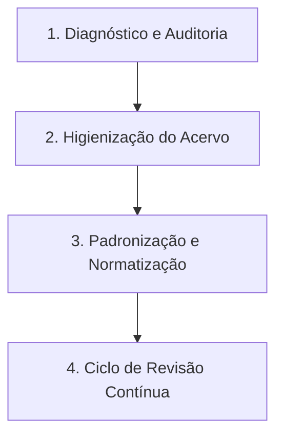

# 📁 Projeto de Gestão e Manutenção de Acervo Documental

> Modelo estruturado para a governança, padronização e manutenção contínua de acervos documentais corporativos.

---

## 🎯 Sobre o Projeto
Este projeto define as diretrizes, processos e ferramentas necessários para implementar uma governança documental eficiente. O objetivo principal é eliminar documentos obsoletos, garantir a conformidade com normas de qualidade (como a ISO 9001) e manter o ciclo de revisão permanentemente atualizado.

## 🚀 Pilares Estratégicos
* **Governança Eficiente:** Centralização e controle rigoroso do ciclo de vida dos documentos.
* **Padronização Total:** Alinhamento com as normas de qualidade e diretrizes corporativas.
* **Mitigação de Riscos:** Eliminação sistemática de informações obsoletas ou duplicadas.

## 🗺️ Etapas de Implementação

1. **Diagnóstico e Auditoria:** Mapeamento completo do acervo atual e identificação de gargalos.
2. **Higienização do Acervo:** Descarte seguro e em conformidade legal de documentos obsoletos.
3. **Padronização e Normatização:** Criação de templates e regras de nomenclatura claras.
4. **Ciclo de Revisão Contínua:** Definição de cronogramas automáticos para novas análises.

---

## 📂 Arquivos e Artefatos do Projeto
Nesta pasta você encontra as ferramentas práticas desenvolvidas para este modelo de governança:

* ⏳ **[Tabela de Temporalidade Documental](tabela-temporalidade.md):** Prazos de guarda e destinação final de cada tipo de arquivo.
* 📋 **[Checklist de Auditoria](./checklist-auditoria.md):** Modelo operacional para validar a conformidade de novos documentos.
